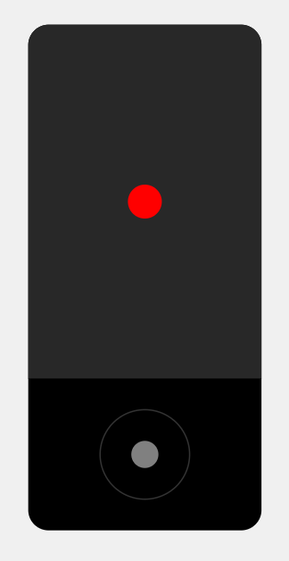
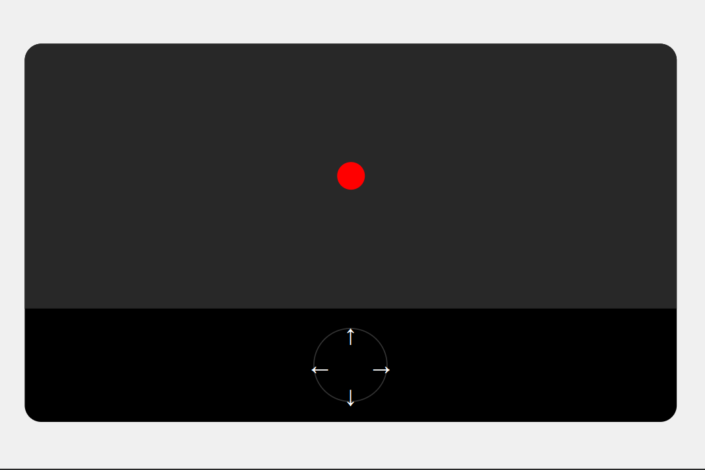

# Virtual Joystick

## 📖 Overview

This is a simple web application that simulates a virtual joystick for controlling a circle inside a game area. It supports both touch controls (for mobile devices) and keyboard controls (for desktop users). This project is designed to work seamlessly across different devices and screen sizes.

## ✨ Features

- Touch Controls: A virtual joystick for moving the circle on touch devices.
- Keyboard Controls: Use arrow keys to move the circle on non-touch devices.
- Responsive Design: Adjusts to different screen sizes.
- Optimized for Performance: Smooth animations and event handling for better responsiveness.

## 🛠️ Technologies Used

- **HTML5**: Structure of the application.
- **CSS3**: Styling and layout.
- **JavaScript**: Interactive functionalities and game mechanics.

## 🌐 Live Demo

You can access the live version of the app on GitHub Pages at [Live Demo](https://salimov333.github.io/virtual-joystick).

## 🚀 Getting Started

### Prerequisites

- A modern web browser (recommended: Chrome, Firefox, Safari, or Edge).

### Installation

1. **Clone the Repository**:

   ```bash
   git clone https://github.com/salimov333/virtual-joystick.git
   ```

2. **Navigate to the Project Directory**:
   ```bash
   cd virtual-joystick
   ```

### Running the App

1. **Open the `index.html` File**:

   - Double-click the file or drag it into your browser to launch the app.

2. **Interface**: The application features a game area with a red circle and a joystick (circular control area) at the bottom.

## 🎮 Usage Instructions

### Mobile Devices

- **Touch and Hold**: Press and drag within the control area to move the red circle.
- **Release**: Lift your finger to stop moving the circle.

### Desktop

- **Keyboard Controls**: Use the following keys to control the movement of the circle:
  - `Arrow Up`: Move up
  - `Arrow Down`: Move down
  - `Arrow Left`: Move left
  - `Arrow Right`: Move right

## 📸 Screenshots



