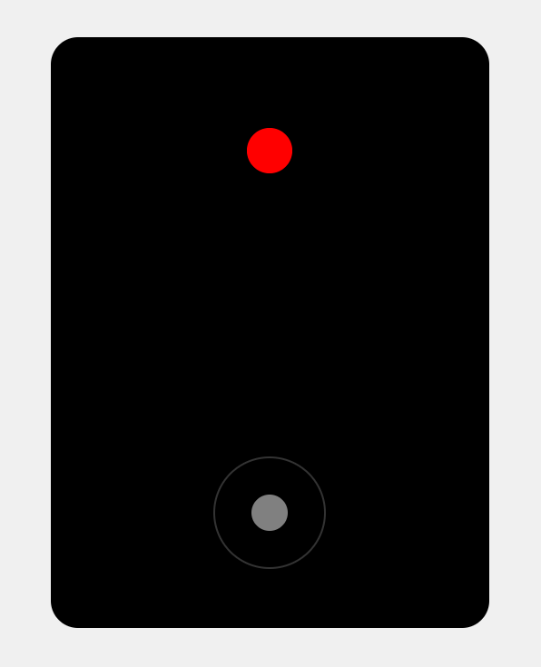

# Virtual Joystick

## 📖 Overview

This application simulates a *virtual joystick*, supporting both **touch** and **keyboard** interfaces.

It is an interactive browser-based application that allows users to control a red circle using touch gestures on mobile devices and keyboard inputs on desktop. This intuitive control system provides a seamless gaming experience, enhancing user interaction through simple drag-and-drop mechanics.

## ✨ Features

- **Touch Control**: Effortlessly drag the control ball to move the circle in any direction on mobile devices.
- **Keyboard Control**: Utilize arrow keys to navigate the circle on desktop browsers.
- **Responsive Design**: Fully functional on both mobile and desktop devices, ensuring a consistent experience across platforms.
- **Smooth Movement**: Enhanced movement responsiveness for a more engaging user experience.

## 🛠️ Technologies Used

- **HTML5**: Structure of the application.
- **CSS3**: Styling and layout.
- **JavaScript**: Interactive functionalities and game mechanics.

## 🚀 Getting Started

### Prerequisites

- A modern web browser (recommended: Chrome, Firefox, Safari, or Edge).

### Installation

1. **Clone the Repository**:

   ```bash
   git clone https://github.com/salimov333/virtual-joystick.git
   ```

2. **Navigate to the Project Directory**:
   ```bash
   cd virtual-joystick
   ```

### Running the App

1. **Open the `index.html` File**:

   - Double-click the file or drag it into your browser to launch the app.

2. **Interface**: The application features a black game area with a red circle and a circular control area at the bottom.

## 🎮 Usage Instructions

### Mobile Devices

- **Touch and Hold**: Press and drag within the control area to move the red circle.
- **Release**: Lift your finger to stop moving the circle.

### Desktop

- **Keyboard Controls**: Use the following keys to control the movement of the circle:
  - `Arrow Up`: Move up
  - `Arrow Down`: Move down
  - `Arrow Left`: Move left
  - `Arrow Right`: Move right

## 🌐 Deployment

You can access the live version of the app on GitHub Pages at [Live Demo](https://salimov333.github.io/virtual-joystick).

## 📸 Screenshots


